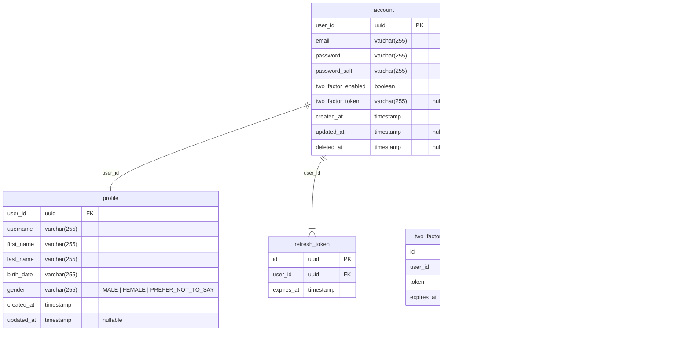

# Database Structure

```mermaid
erDiagram
  account {
    user_id uuid PK
    email varchar(255)
    password varchar(255)
    password_salt varchar(255)
    two_factor_enabled boolean
    two_factor_token varchar(255) "nullable"
    created_at timestamp
    updated_at timestamp "nullable"
    deleted_at timestamp "nullable"
  }

  profile {
    user_id uuid FK
    username varchar(255)
    first_name varchar(255)
    last_name varchar(255)
    birth_date varchar(255)
    gender varchar(255) "MALE | FEMALE | PREFER_NOT_TO_SAY"
    created_at timestamp
    updated_at timestamp "nullable"
    deleted_at timestamp "nullable"
  }
  account ||--|| profile : user_id

  refresh_token {
    id uuid PK
    user_id uuid FK
    expires_at timestamp
  }
  account ||--|{ refresh_token : user_id

  two_factor_authentication_token {
    id uuid PK
    user_id uuid FK
    token varchar(255)
    expires_at timestamp
  }
  account ||--|{ two_factor_authentication_token : user_id

  account_security_code {
    id uuid PK
    user_id uuid FK
    code varchar(255)
    created_at timestamp
    updated_at timestamp "nullable"
    deleted_at timestamp "nullable"
  }
  account ||--|{ account_security_code : user_id
```
