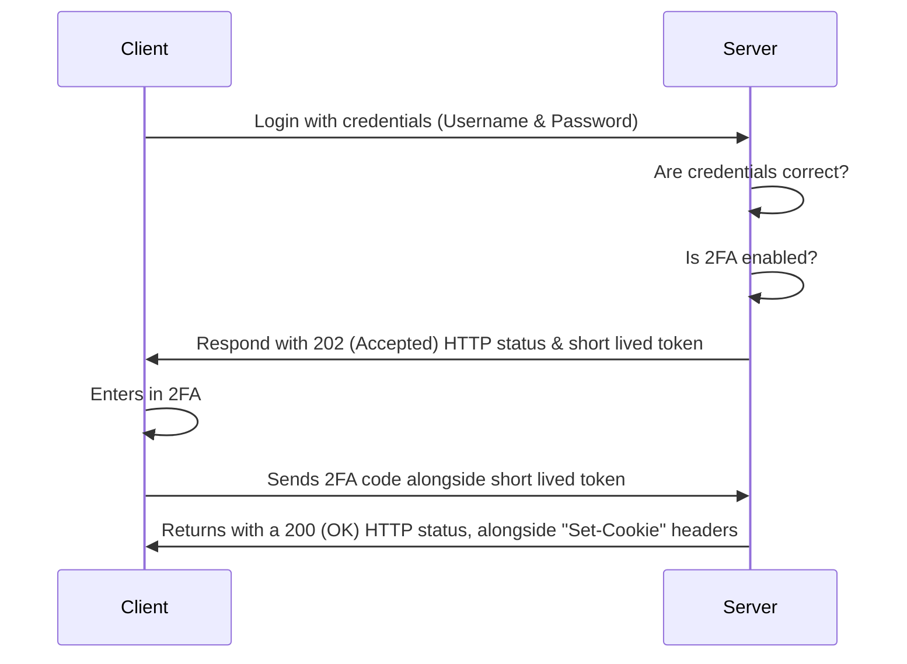

# 2FA Flow Diagram

This diagram shows the sequence flow for when a user wants to login, but also has 2FA enabled on their account. This flow ensures that the 2FA can't be bruteforced without having access to the short lived token.

The short lived token is there to make sure, a hack can't just to into the 2FA page, and start entering codes and then hack into someone else's account.

We use the HTTP status code 202 (Accepted), to indicate that the login with Username & Password was successful, but theres is still a step left in order to fulfill the request.

